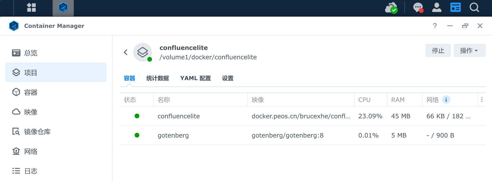
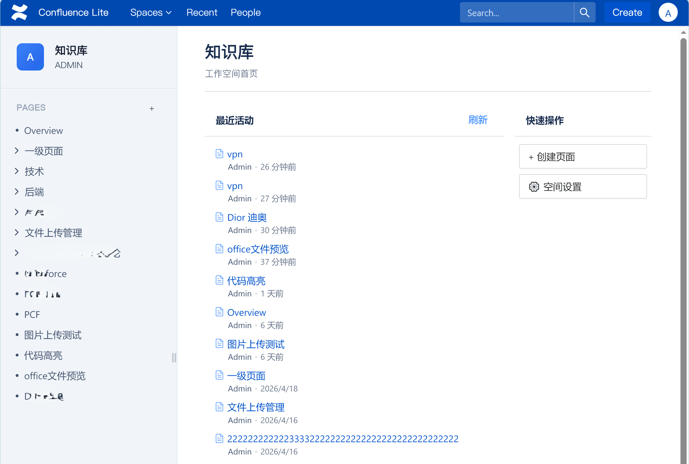
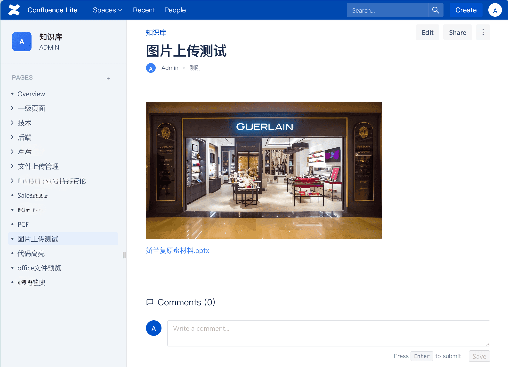
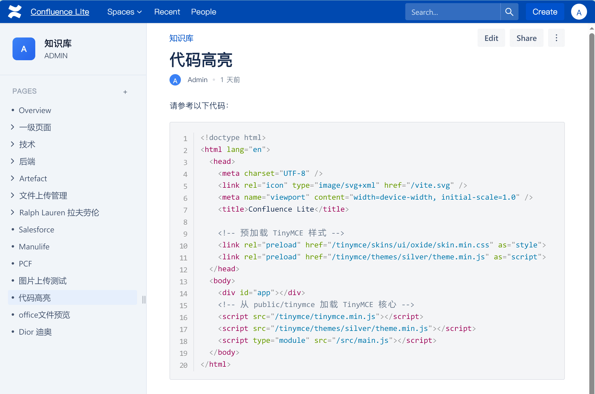
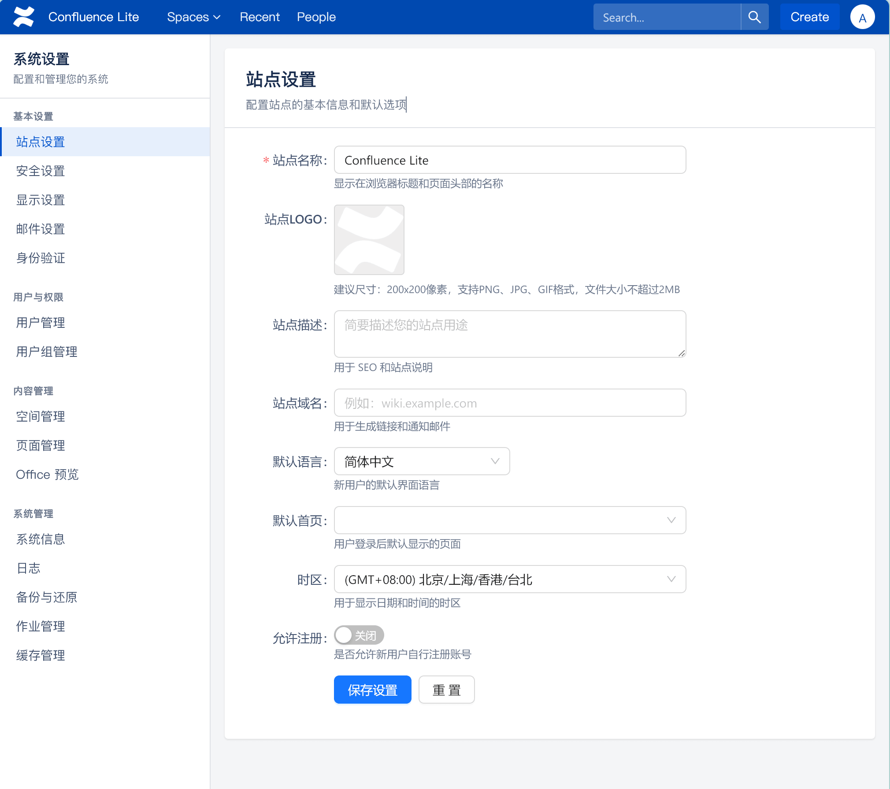

# confluence-lite
轻量级、高性能的现代知识库笔记软件，完美复刻 Confluence 核心体验，最低仅需 50MB 内存即可运行。

#### **简洁 · 高效 · 智能**
本项目全程由 Claude Code 智能生成。 

## ✨ 特性亮点
🚀 极致轻量​ - 完整运行仅需 50MB 内存，是传统知识库工具的 1/10  
🎯 完美复刻​ - 深度还原 Confluence 的核心功能和用户体验  
⚡ 高性能架构​ - Vue3 + .NET 10 + PostgreSQL 16 现代技术栈  
🤖 AI 原生开发​ - 代码全程由 Claude Code 智能生成与优化  
📱 开箱即用​ - 一键部署，五分钟内即可搭建专属知识库  

## 🏗️ 技术架构
前端：Vue 3 + TypeScript + Vite + Pinia  
后端：.NET 10 + ASP.NET Core Web API  
数据库：PostgreSQL 16  
部署：Docker 支持（可选）  

## 🚀 快速开始
### 环境要求
Node.js 18+  
.NET 10 SDK  
PostgreSQL 16  
### 内存：
最低 50MB，推荐 512MB+

## 一键安装 
git clone https://github.com/yourusername/confluence-lite.git  
cd confluence-lite  

### 后端启动
cd server  
dotnet restore  
dotnet run  

### 前端启动（新终端）
cd client  
npm install  
npm run dev  

### 使用docker compose
docker-compose up -d  

 
## 截图

## 进度

- [x] 用户功能
- [x] 空间空间
- [x] 页面功能（创建、编辑、删除、历史版本、查看源码、查看附件）
- [x] 附件功能（拖拽上传）
- [x] 预览（图片预览、PDF/docx/pptx/xlsx预览，需要运行Gotenberg 服务，并在系统设置中开始Office 预览）
- [x] 代码高亮
- [x] 评论功能
- [x] 系统设置
- [x] 站点设置
- [x] 显示设置
- [x] 邮件设置
- [x] 身份验证
- [x] SSO单点登陆集成
- [x] 日志
- [x] 作业管理
- [x] 缓存管理
- [x] 系统从confluence导入
- [x] 全局搜索引擎
- [x] 分享管理
- [x] Confluence导入
- [x] 系统备份
- [x] 页面排序
- [ ] 适配手机端访问
- [ ] 系统恢复
- [ ] 多语言支持（zh-CN/en）

 
 
## 🤝 贡献指南
我们欢迎所有形式的贡献！请参阅 CONTRIBUTING.md了解如何参与。  
Fork 本仓库  
创建功能分支 (git checkout -b feature/xxxFeature)  
提交更改 (git commit -m 'Add some xxxFeature')  
推送分支 (git push origin feature/xxxFeature)  
开启 Pull Request  

## 📄 许可证
本项目基于 MIT 许可证开源 - 查看 LICENSE文件了解详情。

## 🙏 致谢
由 Claude Code​ 全程辅助开发
灵感来源于 Atlassian Confluence
感谢所有贡献者和用户的支持

## ⭐ 支持我们
如果这个项目对您有帮助，请给我们一个 Star！您的支持是我们持续优化的最大动力。
Confluence Lite​ - 让知识管理回归轻量与高效 💡

## ⚠️免责声明 
本项目发布的内容仅供学习与技术研究，严禁用于商业目的。所有素材均来源于网络，版权归其合法拥有者所有。用户需在下载后 **24 小时内**删除，并自觉遵守相关法律法规。因违规使用造成的任何法律责任或经济损失，本项目及开发者概不负责。如有侵权，请联系我们处理

## 标签(tag，仅用于SEO)
confluence,confluence精简版,confluence破解版,仿confluence,开源知识库,开源文档软件,轻量级知识库

Powered By Claude Code